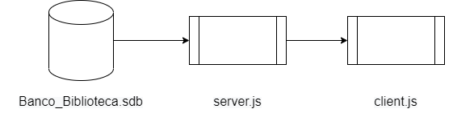

# Biblioteca Digital 

## Objetivo

Criação de uma Biblioteca Digital utilizando NODE.js, sendo essa uma API REST FULL com implementação das funcionalidades a seguir: 

## Funcionalidades

- [x] Cadastrar Autores e Livros;
- [x] Edicação de Autores e Livros;
- [x] Deleção de Autores e Livros;
- [x] Marcar livros como favoritos e lidos;
- [x] Consulta a Biblioteca Digital e aos autores registrados.

## Esquema de Banco de Dados

 
 Nessa API foram utilizadas as bibliotecas [Express](https://expressjs.com/pt-br/) , [Sequelize](https://sequelize.org/) e [Axios](https://github.com/axios/axios), cada uma de facil instalação através de comando npm no terminal do projeto.
 O servidor é executado em host local, na porta 5000 e é conectado ao banco de dados na bibliotaca [SQLite](https://www.sqlite.org/index.html).

 ## A API segue a seguinte arquitetura: 
 

A fim de se faciliar a execução do códgigo da UPI se utilizou o [nodemon](https://nodemon.io/) para atualização constante da execução a cada salvamento e para isso se utilizou de atalhos no arquivo de pacotes JSON (packed.json).
