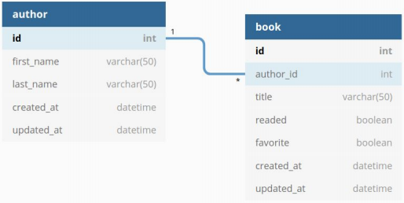

# Biblioteca Digital 

## Objetivo

Criação de uma Biblioteca Digital utilizando NODE.js, sendo essa uma API REST FULL com implementação das funcionalidades a seguir: 

## Funcionalidades

- [x] Cadastrar Autores e Livros
- [x] Edicação de Autores e Livros
- [x] Deleção de Autores e Livros
- [ ] Marcar livros como favoritos e lidos

## Esquema de Banco de Dados

 
